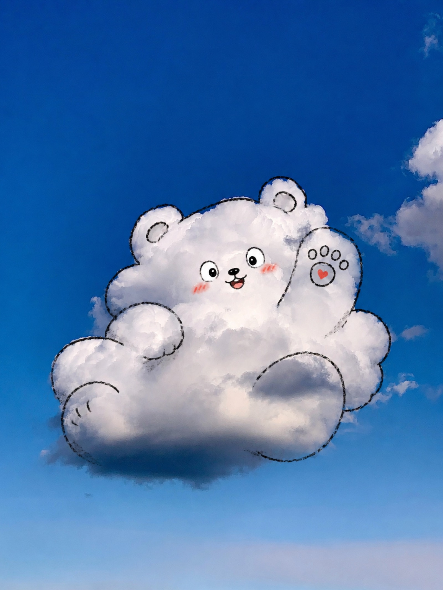
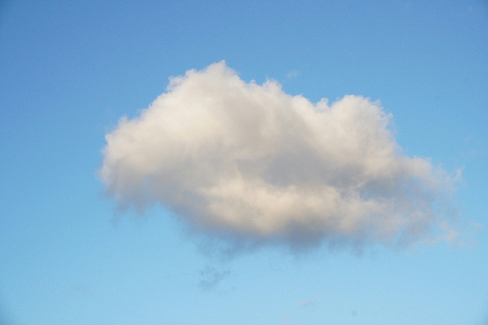
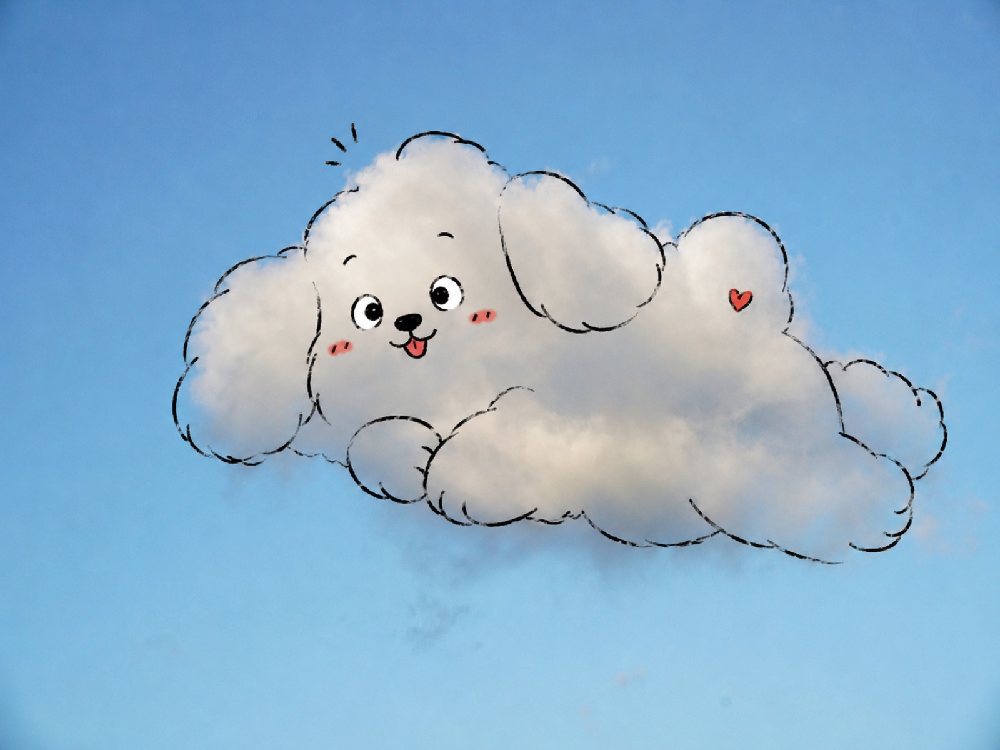
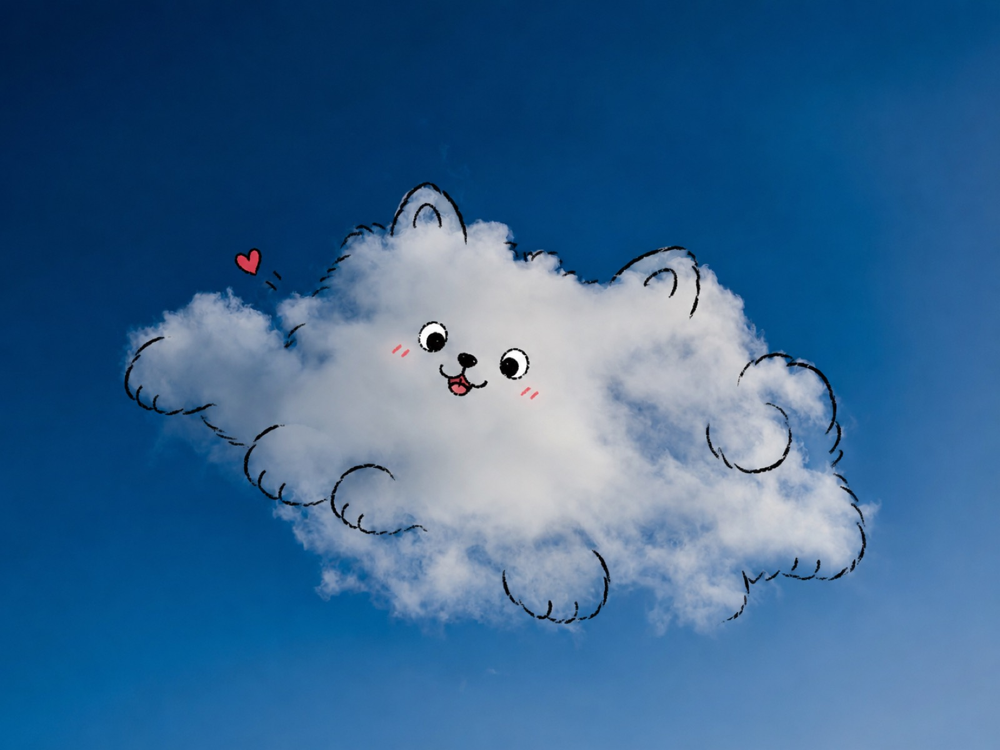

> "这朵云本来就有灵气，只是被轻轻点了一下。"

<div align="center">

*从真实云形里发现角色感，用最少的笔触点出神韵。*

</div>

---

# 一朵小可爱 · Lovely Cloud

<p align="center">
  
  
  
  
</p>

一个给 AI agent 用的 **skill**：把你拍到的云朵照片，用极克制的手绘涂鸦，**点**出这朵云本来就藏着的灵气——不是把云画成卡通贴纸，而是**顺着真实云形，把角色请出来**。

适用于任何能编辑图像的 agent 或图像模型（即梦、豆包、Gemini / Nano Banana 等）。

## 它解决什么

通用的"照片卡通化"工具有一个通病：为了显得"AI 很强"，它们会重绘整片天空、把云涂成实心贴纸、加满装饰，结果**丢掉了照片本身的氛围**。

`lovely-cloud` 反其道而行——它的全部设计都在守一件事：

> 保留原图的天空、光影和留白，只在云上加最少的几笔，让人觉得"这朵云本来就是这样"。

## 核心原则

1. 保留真实照片感；
2. 顺着云形识别，不逆着云形硬画；
3. 神韵优先于可爱；
4. 留白优先于填满；
5. 云不够像时，宁可少做。

## 效果对比｜Before → After

下面用 3 张公开授权的真实云照（来源见文末），跑出前后对比——左边是原图，右边是 `lovely-cloud` 顺着云形点出的角色。

**① 竖幅团云 → 抱抱小熊**

<p align="center">
  
  &nbsp;&nbsp;
  
</p>

**② 横向蓬松云 → 呆萌小狗**

<p align="center">
  
  &nbsp;&nbsp;
  
</p>

**③ 深蓝孤云 → 圆脸小猫**

<p align="center">
  
  &nbsp;&nbsp;
  
</p>

> 每一张都保留了原图的天空、光影和留白，只在云上加了最少的几笔。

## 怎么用

把 `SKILL.md` 交给你的 agent，然后上传一张云朵照片即可。默认**低交互、上传即出单张成品图**；想细调时补一句偏好（"更可爱一点""像猫一点""别加装饰"）。

底层执行时，agent 会隐式遵循一段"保真手绘"的图像编辑指令（见 `SKILL.md` 的「生成执行 Prompt」），你也可以直接把它粘贴给任意图像编辑模型。

## 边界

- **不做**：通用照片卡通化、人像头像、海报排版、多宫格拼图。
- **不碰**：不添加文字/签名/水印，不重绘天空，不把整朵云涂满。
- 云形不明确时，退回"轻表情模式"（两只眼睛 + 一个小嘴），不硬凑角色。

## 目录结构

```text
lovely-cloud/
├── SKILL.md                    # 主指令 + 生成执行 Prompt
├── agents/openai.yaml          # UI 展示元数据（display_name: 一朵小可爱）
├── references/style-guide.md   # 角色判断法、装饰排序、色彩、失败案例、批量一致性
├── assets/boards/              # 前后对比示例图
└── LICENSE
```

## 图片来源｜Credits

对比图的原始云照来自 [Unsplash](https://unsplash.com)（免费可商用），感谢摄影师：

- ① 小熊 [Ivan Nemchinov](https://unsplash.com/@ionemchinov) · ② 小狗 [林 小小](https://unsplash.com/@smalllin) · ③ 小猫 [Bill Eccles](https://unsplash.com/@bill_eccles)

## License

MIT — 见 [LICENSE](./LICENSE)。
